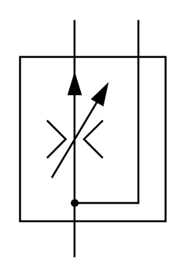

# X10670 Three-port flow-control

## Definition

```
{
  _style: { 
    entity: 'verticalLabelPosition=bottom;aspect=fixed;html=1;verticalAlign=top;fillColor=strokeColor;align=center;outlineConnect=0;shape=mxgraph.fluid_power.x10670;points=[[0.372,0,0],[0.372,1,0],[0.812,0,0]]',
  },
  _original_width: 74.1,
  _original_height: 120.8,
}
```

## Usage

```
import { X10670ThreePortFlowControl } from '@dinghy/standard-components-diagrams/fluidPower'

<X10670ThreePortFlowControl/>
```

## Preview


