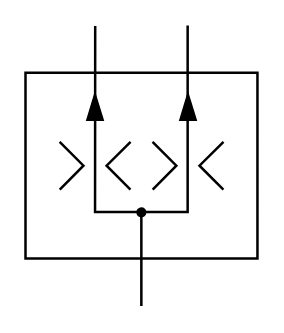

# X10680 Flow divider

## Definition

```
{
  _style: 'verticalLabelPosition=bottom;aspect=fixed;html=1;verticalAlign=top;fillColor=strokeColor;align=center;outlineConnect=0;shape=mxgraph.fluid_power.x10680;points=[[0.3,0,0],[0.7,0,0],[0.5,1,0]]',
  _width: 92.78,
  _height: 112.16,
}
```

## Usage

```
import { X10680FlowDivider } from '@reactiac/standard-components-diagrams/fluidPower'

<X10680FlowDivider/>
```

## Preview


