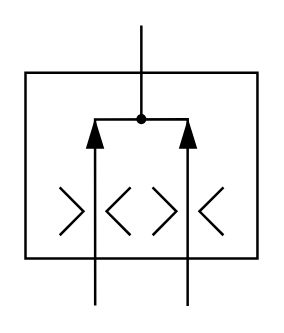

# X10690 Flow-combining valve

## Definition

```
{
  _style: { 
    entity: 'verticalLabelPosition=bottom;aspect=fixed;html=1;verticalAlign=top;fillColor=strokeColor;align=center;outlineConnect=0;shape=mxgraph.fluid_power.x10690;points=[[0.5,0,0],[0.3,1,0],[0.7,1,0]]',
  },
  _original_width: 92.78,
  _original_height: 112.16,
}
```

## Usage

```
import { X10690FlowCombiningValve } from '@dinghy/standard-components-diagrams/fluidPower'

<X10690FlowCombiningValve/>
```

## Preview


