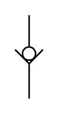

# X10700 Non-return valve,

## Definition

```
{
  _style: { 
    entity: 'verticalLabelPosition=bottom;aspect=fixed;html=1;verticalAlign=top;fillColor=strokeColor;align=center;outlineConnect=0;shape=mxgraph.fluid_power.x10700;points=[[0.5,0,0],[0.5,1,0]]',
  },
  _width: 18.96,
  _height: 56.04,
}
```

## Usage

```
import { X10700NonReturnValve } from '@diac/standard-components-diagrams/fluidPower'

<X10700NonReturnValve/>
```

## Preview


