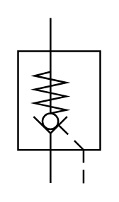

# X10720 Pilot-operated non-return

## Definition

```
{
  _style: { 
    entity: 'verticalLabelPosition=bottom;aspect=fixed;html=1;verticalAlign=top;fillColor=strokeColor;align=center;outlineConnect=0;shape=mxgraph.fluid_power.x10720;points=[[0.395,0,0],[0.395,1,0],[0.795,1,0]]',
  },
  _original_width: 46.4,
  _original_height: 93.58,
}
```

## Usage

```
import { X10720PilotOperatedNonReturn } from '@dinghy/standard-components-diagrams/fluidPower'

<X10720PilotOperatedNonReturn/>
```

## Preview


