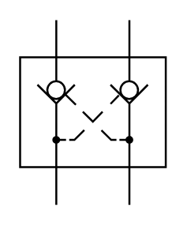

# X10730 Double non-return

## Definition

```
{
  _style: 'verticalLabelPosition=bottom;aspect=fixed;html=1;verticalAlign=top;fillColor=strokeColor;align=center;outlineConnect=0;shape=mxgraph.fluid_power.x10730;points=[[0.248,0,0],[0.248,1,0],[0.75,0,0],[0.75,1,0]]',
  _width: 73.84,
  _height: 93.46,
}
```

## Usage

```
import { X10730DoubleNonReturn } from '@diac/standard-components-diagrams/fluidPower'

<X10730DoubleNonReturn/>
```

## Preview


