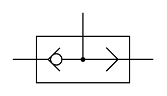

# X10740 Shuttle valve

## Definition

```
{
  _style: 'verticalLabelPosition=bottom;aspect=fixed;html=1;verticalAlign=top;fillColor=strokeColor;align=center;outlineConnect=0;shape=mxgraph.fluid_power.x10740;points=[[0,0.665,0],[1,0.665,0],[0.498,0,0]]',
  _width: 111.72,
  _height: 56,
}
```

## Usage

```
import { X10740ShuttleValve } from '@diac/standard-components-diagrams/fluidPower'

<X10740ShuttleValve/>
```

## Preview


