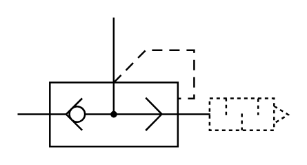

# X10750 Quick-exhaust valve

## Definition

```
{
  _style: 'verticalLabelPosition=bottom;aspect=fixed;html=1;verticalAlign=top;fillColor=strokeColor;align=center;outlineConnect=0;shape=mxgraph.fluid_power.x10750;points=[[0.355,0,0],[0,0.75,0]]',
  _width: 156.94,
  _height: 74.66,
}
```

## Usage

```
import { X10750QuickExhaustValve } from '@reactiac/standard-components-diagrams/fluidPower'

<X10750QuickExhaustValve/>
```

## Preview


