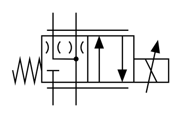

# X10770 Proportional directional

## Definition

```
{
  _style: { 
    entity: 'verticalLabelPosition=bottom;aspect=fixed;html=1;verticalAlign=top;fillColor=strokeColor;align=center;outlineConnect=0;shape=mxgraph.fluid_power.x10770;points=[[0.258,0,0],[0.258,1,0],[0.405,0,0],[0.405,1,0],[1,0.5,0],[1,0.625,0],[1,0.75,0]]',
  },
  _original_width: 125.44,
  _original_height: 74.44,
}
```

## Usage

```
import { X10770ProportionalDirectional } from '@diac/standard-components-diagrams/fluidPower'

<X10770ProportionalDirectional/>
```

## Preview


