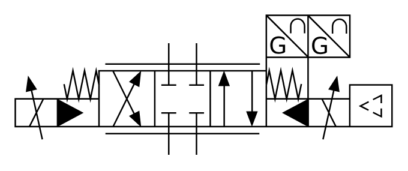

# X10780 Proportional directional

## Definition

```
{
  _style: { 
    entity: 'verticalLabelPosition=bottom;aspect=fixed;html=1;verticalAlign=top;fillColor=strokeColor;align=center;outlineConnect=0;shape=mxgraph.fluid_power.x10780;points=[[0.407,0.2,0],[0.48,0.2,0],[0.407,1,0],[0.48,1,0],[0,0.6,0],[0,0.7,0],[0,0.8,0]]',
  },
  _width: 251.14,
  _height: 93.04,
}
```

## Usage

```
import { X10780ProportionalDirectional } from '@diac/standard-components-diagrams/fluidPower'

<X10780ProportionalDirectional/>
```

## Preview


