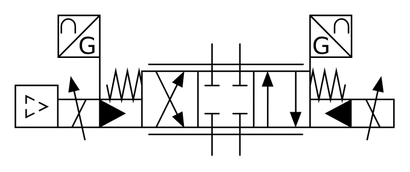

# X10790 Servo-valve, pilot-operated,

## Definition

```
{
  _style: 'verticalLabelPosition=bottom;aspect=fixed;html=1;verticalAlign=top;fillColor=strokeColor;align=center;outlineConnect=0;shape=mxgraph.fluid_power.x10790;points=[[0.332,0.055,0],[0.416,0.055,0],[0.332,1,0],[0.416,1,0],[0,0.5,0],[0,0.625,0],[0,0.75,0]]',
  _width: 251.14,
  _height: 93.04,
}
```

## Usage

```
import { X10790ServoValvePilotOperated } from '@reactiac/standard-components-diagrams/fluidPower'

<X10790ServoValvePilotOperated/>
```

## Preview


