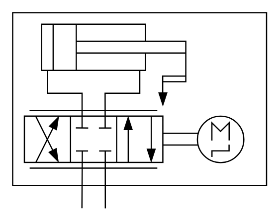

# X10810 Electro-hydraulic linear

## Definition

```
{
  _style: 'verticalLabelPosition=bottom;aspect=fixed;html=1;verticalAlign=top;fillColor=strokeColor;align=center;outlineConnect=0;shape=mxgraph.fluid_power.x10810;points=[[0.272,1,0],[0.364,1,0]]',
  _width: 204.2,
  _height: 157.64,
}
```

## Usage

```
import { X10810ElectroHydraulicLinear } from '@diac/standard-components-diagrams/fluidPower'

<X10810ElectroHydraulicLinear/>
```

## Preview


