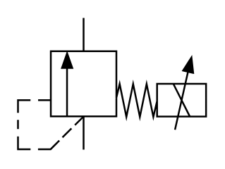

# X10830 Proportional pressure-relief

## Definition

```
{
  _style: 'verticalLabelPosition=bottom;aspect=fixed;html=1;verticalAlign=top;fillColor=strokeColor;align=center;outlineConnect=0;shape=mxgraph.fluid_power.x10830;points=[[0.35,0,0],[0.35,1,0],[1,0.5,0],[1,0.625,0],[1,0.75,0]]',
  _width: 106.66,
  _height: 74.82,
}
```

## Usage

```
import { X10830ProportionalPressureRelief } from '@diac/standard-components-diagrams/fluidPower'

<X10830ProportionalPressureRelief/>
```

## Preview


