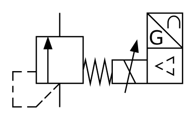

# X10850 Proportional pressure-relief

## Definition

```
{
  _style: { 
    entity: 'verticalLabelPosition=bottom;aspect=fixed;html=1;verticalAlign=top;fillColor=strokeColor;align=center;outlineConnect=0;shape=mxgraph.fluid_power.x10850;points=[[0.277,0,0],[0.277,1,0]]',
  },
  _width: 134.72,
  _height: 74.82,
}
```

## Usage

```
import { X10850ProportionalPressureRelief } from '@diac/standard-components-diagrams/fluidPower'

<X10850ProportionalPressureRelief/>
```

## Preview


