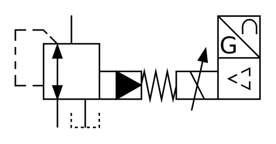

# X10870 Three-port proportional

## Definition

```
{
  _style: 'verticalLabelPosition=bottom;aspect=fixed;html=1;verticalAlign=top;fillColor=strokeColor;align=center;outlineConnect=0;shape=mxgraph.fluid_power.x10870;points=[[0.23,0,0],[0.17,1,0],[0.285,1,0]]',
  _width: 162.38,
  _height: 74.92,
}
```

## Usage

```
import { X10870ThreePortProportional } from '@reactiac/standard-components-diagrams/fluidPower'

<X10870ThreePortProportional/>
```

## Preview


