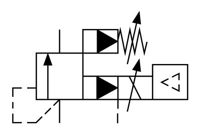

# X10880 Proportional pressure-relief

## Definition

```
{
  _style: 'verticalLabelPosition=bottom;aspect=fixed;html=1;verticalAlign=top;fillColor=strokeColor;align=center;outlineConnect=0;shape=mxgraph.fluid_power.x10880;points=[[0.267,0.15,0],[0.267,1,0],[0.6,1,0]]',
  _width: 139.14,
  _height: 88.42,
}
```

## Usage

```
import { X10880ProportionalPressureRelief } from '@diac/standard-components-diagrams/fluidPower'

<X10880ProportionalPressureRelief/>
```

## Preview


