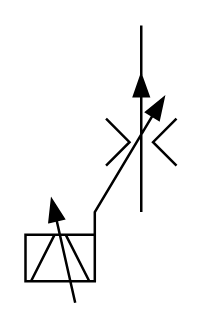

# X10920 Adjustable-orifice flow-control

## Definition

```
{
  _style: 'verticalLabelPosition=bottom;aspect=fixed;html=1;verticalAlign=top;fillColor=strokeColor;align=center;outlineConnect=0;shape=mxgraph.fluid_power.x10920;points=[[0.77,0,0],[0.77,0.673,0]]',
  _width: 60.4,
  _height: 110.94,
}
```

## Usage

```
import { X10920AdjustableOrificeFlowControl } from '@reactiac/standard-components-diagrams/fluidPower'

<X10920AdjustableOrificeFlowControl/>
```

## Preview


