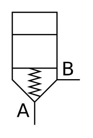

# X10940 Pressure-control and

## Definition

```
{
  _style: 'verticalLabelPosition=bottom;aspect=fixed;html=1;verticalAlign=top;fillColor=strokeColor;align=center;outlineConnect=0;shape=mxgraph.fluid_power.x10940;points=[[0.335,1,0],[1,0.6,0]]',
  _width: 56.1,
  _height: 93.28,
}
```

## Usage

```
import { X10940PressureControlAnd } from '@reactiac/standard-components-diagrams/fluidPower'

<X10940PressureControlAnd/>
```

## Preview


