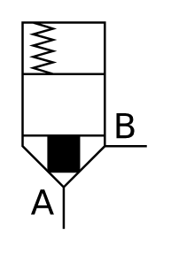

# X10950 Directional control

## Definition

```
{
  _style: { 
    entity: 'verticalLabelPosition=bottom;aspect=fixed;html=1;verticalAlign=top;fillColor=strokeColor;align=center;outlineConnect=0;shape=mxgraph.fluid_power.x10950;points=[[0.335,1,0],[1,0.6,0]]',
  },
  _original_width: 56.1,
  _original_height: 93.28,
}
```

## Usage

```
import { X10950DirectionalControl } from '@dinghy/standard-components-diagrams/fluidPower'

<X10950DirectionalControl/>
```

## Preview


