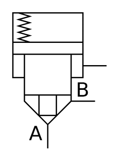

# X10990 Active-control, directional

## Definition

```
{
  _style: 'verticalLabelPosition=bottom;aspect=fixed;html=1;verticalAlign=top;fillColor=strokeColor;align=center;outlineConnect=0;shape=mxgraph.fluid_power.x10990;points=[[0.37,1,0],[1,0.39,0],[0.878,0.653,0]]',
  _width: 74.36,
  _height: 107.38,
}
```

## Usage

```
import { X10990ActiveControlDirectional } from '@reactiac/standard-components-diagrams/fluidPower'

<X10990ActiveControlDirectional/>
```

## Preview


