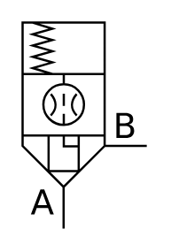

# X11010 Directional control

## Definition

```
{
  _style: 'verticalLabelPosition=bottom;aspect=fixed;html=1;verticalAlign=top;fillColor=strokeColor;align=center;outlineConnect=0;shape=mxgraph.fluid_power.x11010;points=[[0.335,1,0],[1,0.6,0]]',
  _width: 56.06,
  _height: 93.2,
}
```

## Usage

```
import { X11010DirectionalControl } from '@reactiac/standard-components-diagrams/fluidPower'

<X11010DirectionalControl/>
```

## Preview


