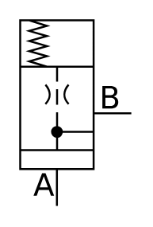

# X11020 Cartridge for

## Definition

```
{
  _style: 'verticalLabelPosition=bottom;aspect=fixed;html=1;verticalAlign=top;fillColor=strokeColor;align=center;outlineConnect=0;shape=mxgraph.fluid_power.x11020;points=[[0.33,1,0],[1,0.5,0]]',
  _width: 56.06,
  _height: 93.2,
}
```

## Usage

```
import { X11020CartridgeFor } from '@reactiac/standard-components-diagrams/fluidPower'

<X11020CartridgeFor/>
```

## Preview


