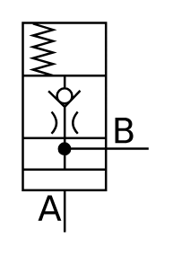

# X11040 Pressure-reducing valve

## Definition

```
{
  _style: { 
    entity: 'verticalLabelPosition=bottom;aspect=fixed;html=1;verticalAlign=top;fillColor=strokeColor;align=center;outlineConnect=0;shape=mxgraph.fluid_power.x11040;points=[[0.33,1,0],[1,0.6,0]]',
  },
  _width: 56.12,
  _height: 93.2,
}
```

## Usage

```
import { X11040PressureReducingValve } from '@diac/standard-components-diagrams/fluidPower'

<X11040PressureReducingValve/>
```

## Preview


