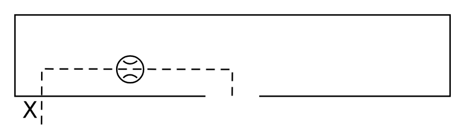

# X11060 Control cover

## Definition

```
{
  _style: { 
    entity: 'verticalLabelPosition=bottom;aspect=fixed;html=1;verticalAlign=top;fillColor=strokeColor;align=center;outlineConnect=0;shape=mxgraph.fluid_power.x11060;points=[[0.061,1,0],[0.499,0.75,0]]',
  },
  _original_width: 296.94,
  _original_height: 74.78,
}
```

## Usage

```
import { X11060ControlCover } from '@diac/standard-components-diagrams/fluidPower'

<X11060ControlCover/>
```

## Preview


