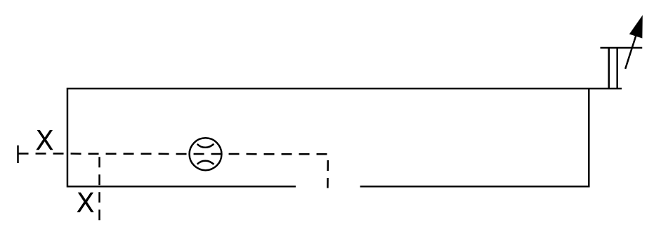

# X11070 Control cover

## Definition

```
{
  _style: 'verticalLabelPosition=bottom;aspect=fixed;html=1;verticalAlign=top;fillColor=strokeColor;align=center;outlineConnect=0;shape=mxgraph.fluid_power.x11070;points=[[0.13,1,0],[0.497,0.84,0]]',
  _width: 355.5,
  _height: 115.12,
}
```

## Usage

```
import { X11070ControlCover } from '@diac/standard-components-diagrams/fluidPower'

<X11070ControlCover/>
```

## Preview


