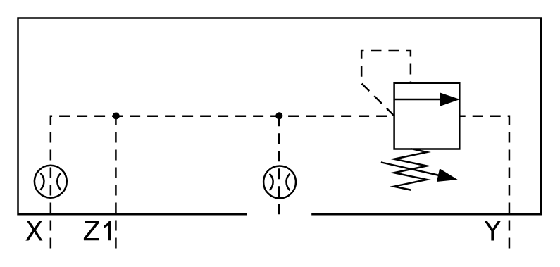

# X11120 Control cover

## Definition

```
{
  _style: { 
    entity: 'verticalLabelPosition=bottom;aspect=fixed;html=1;verticalAlign=top;fillColor=strokeColor;align=center;outlineConnect=0;shape=mxgraph.fluid_power.x11120;points=[[0.062,1,0],[0.187,1,0],[0.5,0.86,0],[0.94,1,0]]',
  },
  _original_width: 296.94,
  _original_height: 130.8,
}
```

## Usage

```
import { X11120ControlCover } from '@diac/standard-components-diagrams/fluidPower'

<X11120ControlCover/>
```

## Preview


