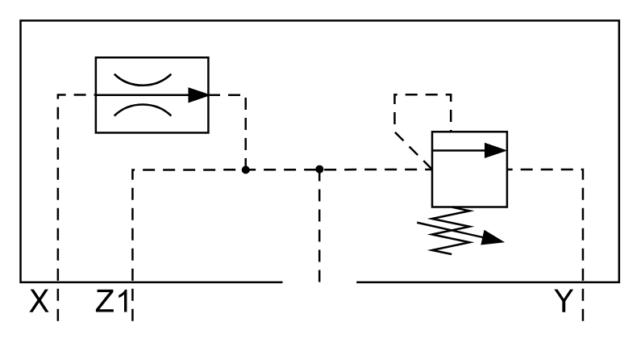

# X11140 Control cover

## Definition

```
{
  _style: 'verticalLabelPosition=bottom;aspect=fixed;html=1;verticalAlign=top;fillColor=strokeColor;align=center;outlineConnect=0;shape=mxgraph.fluid_power.x11140;points=[[0.062,1,0],[0.187,1,0],[0.5,0.88,0],[0.94,1,0]]',
  _width: 296.94,
  _height: 148.92,
}
```

## Usage

```
import { X11140ControlCover } from '@reactiac/standard-components-diagrams/fluidPower'

<X11140ControlCover/>
```

## Preview


