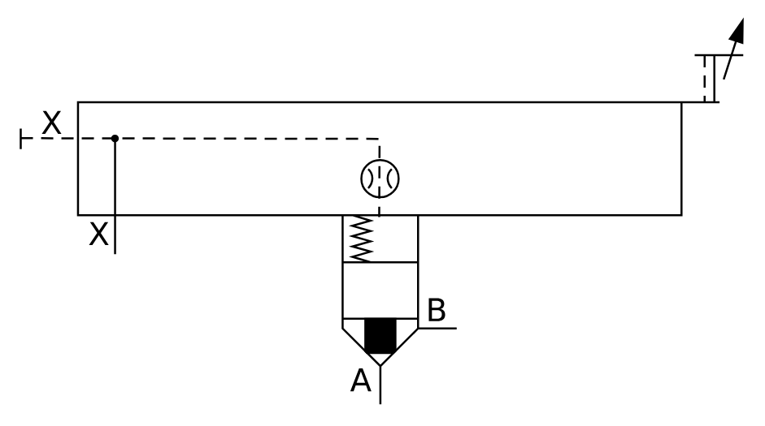

# X11150 Two-port cartridge

## Definition

```
{
  _style: 'verticalLabelPosition=bottom;aspect=fixed;html=1;verticalAlign=top;fillColor=strokeColor;align=center;outlineConnect=0;shape=mxgraph.fluid_power.x11150;points=[[0,0.307,0],[0.13,0.61,0],[0.497,1,0],[0.603,0.803,0]]',
  _width: 355.5,
  _height: 189.12,
}
```

## Usage

```
import { X11150TwoPortCartridge } from '@diac/standard-components-diagrams/fluidPower'

<X11150TwoPortCartridge/>
```

## Preview


