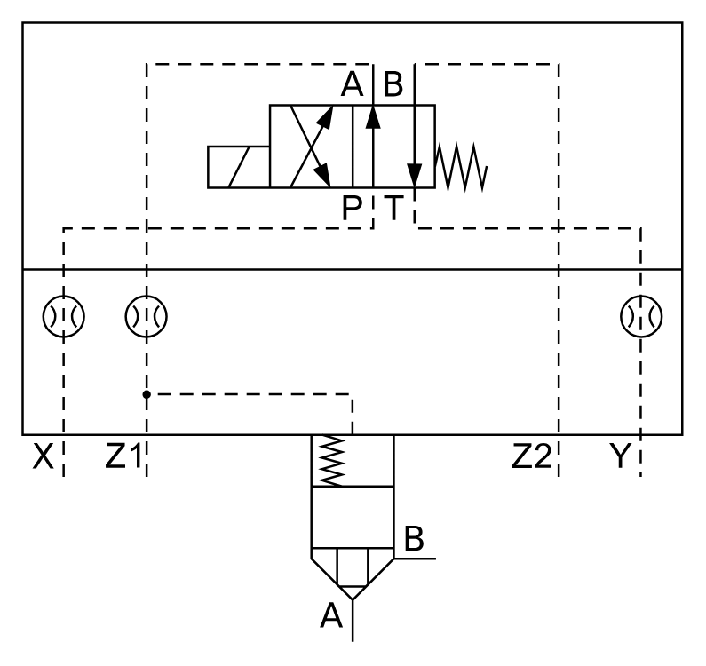

# X11160 Two-port cartridge

## Definition

```
{
  _style: { 
    entity: 'verticalLabelPosition=bottom;aspect=fixed;html=1;verticalAlign=top;fillColor=strokeColor;align=center;outlineConnect=0;shape=mxgraph.fluid_power.x11160;points=[[0.062,0.733,0],[0.188,0.733,0],[0.5,1,0],[0.627,0.867,0],[0.812,0.733,0],[0.937,0.733,0]]',
  },
  _original_width: 297.1,
  _original_height: 278.88,
}
```

## Usage

```
import { X11160TwoPortCartridge } from '@diac/standard-components-diagrams/fluidPower'

<X11160TwoPortCartridge/>
```

## Preview


