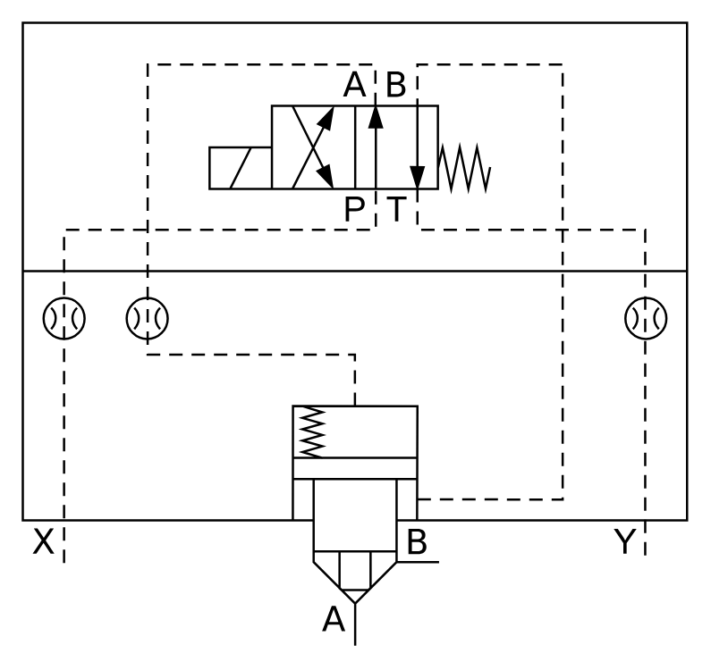

# X11170 Two-port cartridge

## Definition

```
{
  _style: 'verticalLabelPosition=bottom;aspect=fixed;html=1;verticalAlign=top;fillColor=strokeColor;align=center;outlineConnect=0;shape=mxgraph.fluid_power.x11170;points=[[0.062,0.867,0],[0.5,1,0],[0.627,0.867,0],[0.937,0.867,0]]',
  _width: 297.1,
  _height: 278.88,
}
```

## Usage

```
import { X11170TwoPortCartridge } from '@reactiac/standard-components-diagrams/fluidPower'

<X11170TwoPortCartridge/>
```

## Preview


