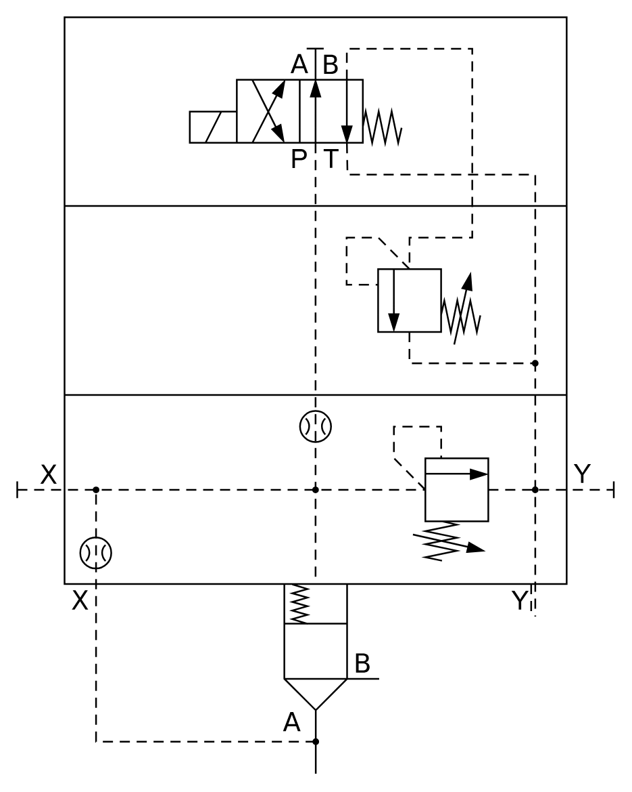

# X11190 Two-port cartridge

## Definition

```
{
  _style: { 
    entity: 'verticalLabelPosition=bottom;aspect=fixed;html=1;verticalAlign=top;fillColor=strokeColor;align=center;outlineConnect=0;shape=mxgraph.fluid_power.x11190;points=[[0,0.624,0],[1,0.624,0],[0.5,1,0],[0.607,0.873,0],[0.86,0.79,0],[0.868,0.79,0]]',
  },
  _original_width: 353.02,
  _original_height: 446.62,
}
```

## Usage

```
import { X11190TwoPortCartridge } from '@diac/standard-components-diagrams/fluidPower'

<X11190TwoPortCartridge/>
```

## Preview


