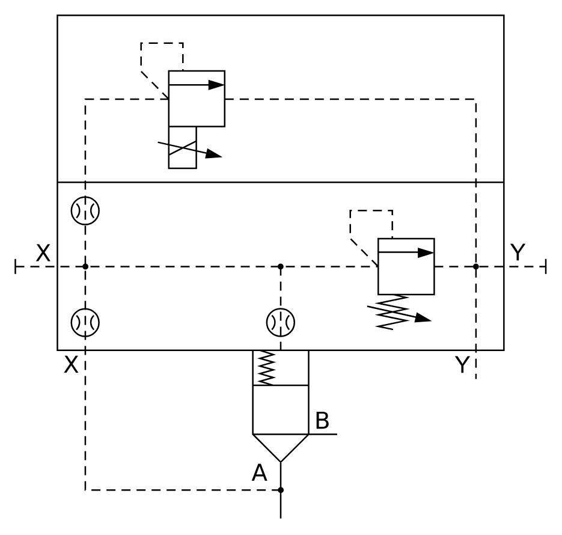

# X11200 Two-port cartridge

## Definition

```
{
  _style: 'verticalLabelPosition=bottom;aspect=fixed;html=1;verticalAlign=top;fillColor=strokeColor;align=center;outlineConnect=0;shape=mxgraph.fluid_power.x11200;points=[[0,0.5,0],[1,0.5,0],[0.5,1,0],[0.606,0.832,0],[0.868,0.722,0]]',
  _width: 353.02,
  _height: 334.82,
}
```

## Usage

```
import { X11200TwoPortCartridge } from '@reactiac/standard-components-diagrams/fluidPower'

<X11200TwoPortCartridge/>
```

## Preview


