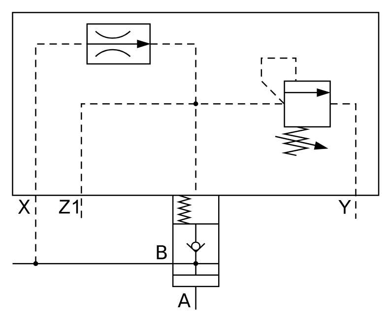

# X11210 Two-port cartridge

## Definition

```
{
  _style: 'verticalLabelPosition=bottom;aspect=fixed;html=1;verticalAlign=top;fillColor=strokeColor;align=center;outlineConnect=0;shape=mxgraph.fluid_power.x11210;points=[[0,0.843,0],[0.5,1,0],[0.936,0.693,0]]',
  _width: 297.38,
  _height: 241.7,
}
```

## Usage

```
import { X11210TwoPortCartridge } from '@diac/standard-components-diagrams/fluidPower'

<X11210TwoPortCartridge/>
```

## Preview


