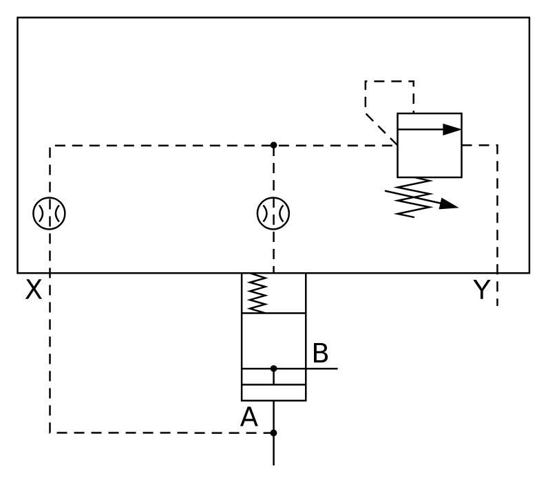

# X11220 Two-port cartridge

## Definition

```
{
  _style: { 
    entity: 'verticalLabelPosition=bottom;aspect=fixed;html=1;verticalAlign=top;fillColor=strokeColor;align=center;outlineConnect=0;shape=mxgraph.fluid_power.x11220;points=[[0.5,1,0],[0.625,0.784,0],[0.937,0.643,0]]',
  },
  _width: 297.38,
  _height: 260.58,
}
```

## Usage

```
import { X11220TwoPortCartridge } from '@diac/standard-components-diagrams/fluidPower'

<X11220TwoPortCartridge/>
```

## Preview


