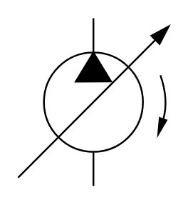

# X11230 Variable-displacement pump

## Definition

```
{
  _style: { 
    entity: 'verticalLabelPosition=bottom;aspect=fixed;html=1;verticalAlign=top;fillColor=strokeColor;align=center;outlineConnect=0;shape=mxgraph.fluid_power.x11230;points=[[0.5,0,0],[0.5,1,0]]',
  },
  _width: 84.54,
  _height: 93.94,
}
```

## Usage

```
import { X11230VariableDisplacementPump } from '@diac/standard-components-diagrams/fluidPower'

<X11230VariableDisplacementPump/>
```

## Preview


