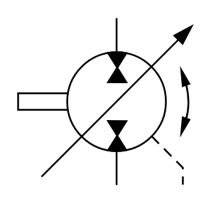

# X11250 Reversible pump/motor

## Definition

```
{
  _style: 'verticalLabelPosition=bottom;aspect=fixed;html=1;verticalAlign=top;fillColor=strokeColor;align=center;outlineConnect=0;shape=mxgraph.fluid_power.x11250;points=[[0.567,0,0],[0.567,1,0],[0.95,1,0]]',
  _width: 97.7,
  _height: 93.94,
}
```

## Usage

```
import { X11250ReversiblePumpMotor } from '@reactiac/standard-components-diagrams/fluidPower'

<X11250ReversiblePumpMotor/>
```

## Preview


