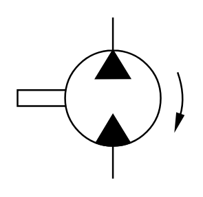

# X11260 Fixed displacement

## Definition

```
{
  _style: { 
    entity: 'verticalLabelPosition=bottom;aspect=fixed;html=1;verticalAlign=top;fillColor=strokeColor;align=center;outlineConnect=0;shape=mxgraph.fluid_power.x11260;points=[[0.57,0,0],[0.57,1,0]]',
  },
  _original_width: 96.84,
  _original_height: 93.94,
}
```

## Usage

```
import { X11260FixedDisplacement } from '@diac/standard-components-diagrams/fluidPower'

<X11260FixedDisplacement/>
```

## Preview


