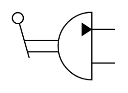

# X11270 Pump with

## Definition

```
{
  _style: 'verticalLabelPosition=bottom;aspect=fixed;html=1;verticalAlign=top;fillColor=strokeColor;align=center;outlineConnect=0;shape=mxgraph.fluid_power.x11270;points=[[1,0.25,0],[1,0.75,0]]',
  _width: 84.6,
  _height: 55.74,
}
```

## Usage

```
import { X11270PumpWith } from '@diac/standard-components-diagrams/fluidPower'

<X11270PumpWith/>
```

## Preview


