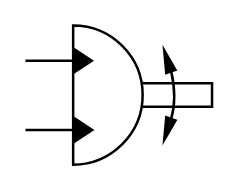

# X11280 Rotary actuator/swivel

## Definition

```
{
  _style: { 
    entity: 'verticalLabelPosition=bottom;aspect=fixed;html=1;verticalAlign=top;fillColor=strokeColor;align=center;outlineConnect=0;shape=mxgraph.fluid_power.x11280;points=[[0,0.25,0],[0,0.75,0]]',
  },
  _original_width: 74.62,
  _original_height: 55.74,
}
```

## Usage

```
import { X11280RotaryActuatorSwivel } from '@diac/standard-components-diagrams/fluidPower'

<X11280RotaryActuatorSwivel/>
```

## Preview


