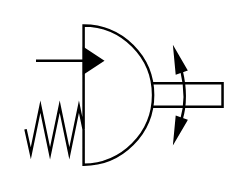

# X11290 Semi-rotary actuator/swivel

## Definition

```
{
  _style: { 
    entity: 'verticalLabelPosition=bottom;aspect=fixed;html=1;verticalAlign=top;fillColor=strokeColor;align=center;outlineConnect=0;shape=mxgraph.fluid_power.x11290;points=[[0.053,0.25,0]]',
  },
  _original_width: 78.82,
  _original_height: 55.74,
}
```

## Usage

```
import { X11290SemiRotaryActuatorSwivel } from '@dinghy/standard-components-diagrams/fluidPower'

<X11290SemiRotaryActuatorSwivel/>
```

## Preview


