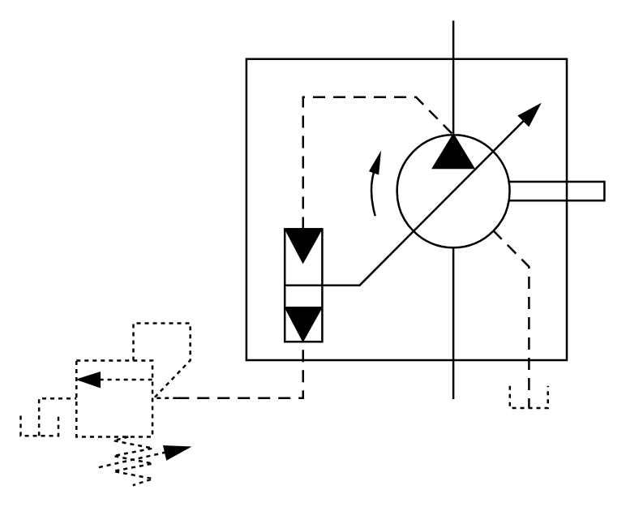

# X11300 Variable-displacement pump,

## Definition

```
{
  _style: { 
    entity: 'verticalLabelPosition=bottom;aspect=fixed;html=1;verticalAlign=top;fillColor=strokeColor;align=center;outlineConnect=0;shape=mxgraph.fluid_power.x11300;points=[[0.03,0.895,0],[0.742,0,0],[0.742,0.815,0],[0.871,0.833,0]]',
  },
  _original_width: 287.96,
  _original_height: 229.08,
}
```

## Usage

```
import { X11300VariableDisplacementPump } from '@diac/standard-components-diagrams/fluidPower'

<X11300VariableDisplacementPump/>
```

## Preview


