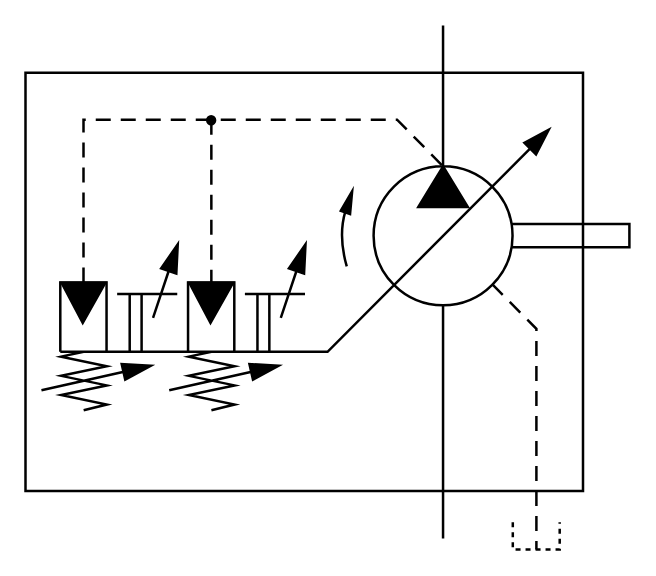

# X11350 Variable-displacement pump

## Definition

```
{
  _style: { 
    entity: 'verticalLabelPosition=bottom;aspect=fixed;html=1;verticalAlign=top;fillColor=strokeColor;align=center;outlineConnect=0;shape=mxgraph.fluid_power.x11350;points=[[0.69,0,0],[0.69,0.98,0],[0.845,1,0]]',
  },
  _width: 241.56,
  _height: 209.6,
}
```

## Usage

```
import { X11350VariableDisplacementPump } from '@diac/standard-components-diagrams/fluidPower'

<X11350VariableDisplacementPump/>
```

## Preview


