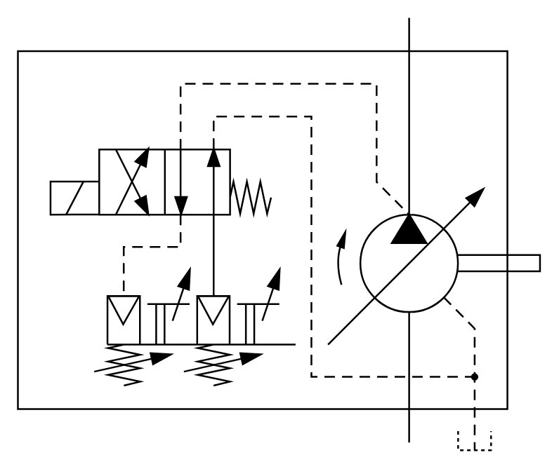

# X11360 Variable-displacement pump

## Definition

```
{
  _style: 'verticalLabelPosition=bottom;aspect=fixed;html=1;verticalAlign=top;fillColor=strokeColor;align=center;outlineConnect=0;shape=mxgraph.fluid_power.x11360;points=[[0.75,0,0],[0.75,0.982,0],[0.875,1,0]]',
  _width: 297.38,
  _height: 246.66,
}
```

## Usage

```
import { X11360VariableDisplacementPump } from '@reactiac/standard-components-diagrams/fluidPower'

<X11360VariableDisplacementPump/>
```

## Preview


