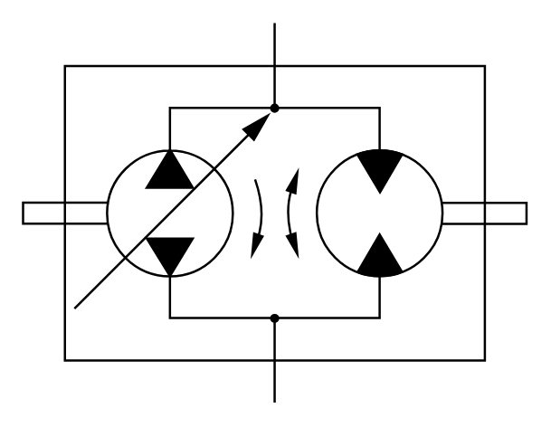

# X11370 Hydrostatic transmission

## Definition

```
{
  _style: 'verticalLabelPosition=bottom;aspect=fixed;html=1;verticalAlign=top;fillColor=strokeColor;align=center;outlineConnect=0;shape=mxgraph.fluid_power.x11370;points=[[0.5,0,0],[0.5,1,0]]',
  _width: 222.58,
  _height: 167.82,
}
```

## Usage

```
import { X11370HydrostaticTransmission } from '@diac/standard-components-diagrams/fluidPower'

<X11370HydrostaticTransmission/>
```

## Preview


