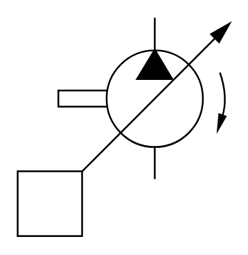

# X11380 Variable-displacement pump

## Definition

```
{
  _style: 'verticalLabelPosition=bottom;aspect=fixed;html=1;verticalAlign=top;fillColor=strokeColor;align=center;outlineConnect=0;shape=mxgraph.fluid_power.x11380;points=[[0.645,0,0],[0.645,0.74,0]]',
  _width: 122.38,
  _height: 125.68,
}
```

## Usage

```
import { X11380VariableDisplacementPump } from '@reactiac/standard-components-diagrams/fluidPower'

<X11380VariableDisplacementPump/>
```

## Preview


