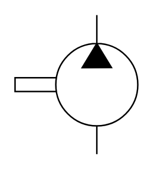

# X11400 Compressor

## Definition

```
{
  _style: 'verticalLabelPosition=bottom;aspect=fixed;html=1;verticalAlign=top;fillColor=strokeColor;align=center;outlineConnect=0;shape=mxgraph.fluid_power.x11400;points=[[0.666,0,0],[0.666,1,0]]',
  _width: 83.22,
  _height: 93.94,
}
```

## Usage

```
import { X11400Compressor } from '@reactiac/standard-components-diagrams/fluidPower'

<X11400Compressor/>
```

## Preview


