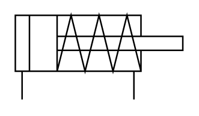

# X11440 Single-acting, single-rod

## Definition

```
{
  _style: { 
    entity: 'verticalLabelPosition=bottom;aspect=fixed;html=1;verticalAlign=top;fillColor=strokeColor;align=center;outlineConnect=0;shape=mxgraph.fluid_power.x11440;points=[[0.04,1,0],[0.707,1,0]]',
  },
  _original_width: 111.42,
  _original_height: 56.04,
}
```

## Usage

```
import { X11440SingleActingSingleRod } from '@dinghy/standard-components-diagrams/fluidPower'

<X11440SingleActingSingleRod/>
```

## Preview


