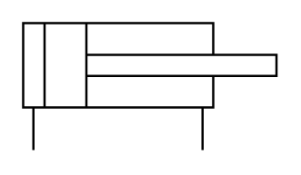

# X11450 Double-acting, single-rod

## Definition

```
{
  _style: 'verticalLabelPosition=bottom;aspect=fixed;html=1;verticalAlign=top;fillColor=strokeColor;align=center;outlineConnect=0;shape=mxgraph.fluid_power.x11450;points=[[0.04,1,0],[0.707,1,0]]',
  _width: 111.42,
  _height: 56.04,
}
```

## Usage

```
import { X11450DoubleActingSingleRod } from '@diac/standard-components-diagrams/fluidPower'

<X11450DoubleActingSingleRod/>
```

## Preview


