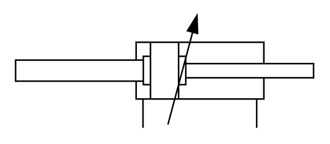

# X11460 Double-acting, double-rod

## Definition

```
{
  _style: { 
    entity: 'verticalLabelPosition=bottom;aspect=fixed;html=1;verticalAlign=top;fillColor=strokeColor;align=center;outlineConnect=0;shape=mxgraph.fluid_power.x11460;points=[[0.427,1,0],[0.81,1,0]]',
  },
  _original_width: 195.04,
  _original_height: 73.56,
}
```

## Usage

```
import { X11460DoubleActingDoubleRod } from '@dinghy/standard-components-diagrams/fluidPower'

<X11460DoubleActingDoubleRod/>
```

## Preview


