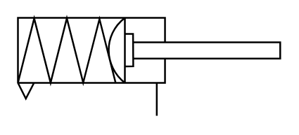

# X11480 Single-acting diaphragm

## Definition

```
{
  _style: { 
    entity: 'verticalLabelPosition=bottom;aspect=fixed;html=1;verticalAlign=top;fillColor=strokeColor;align=center;outlineConnect=0;shape=mxgraph.fluid_power.x11480;points=[[0.53,1,0]]',
  },
  _original_width: 149.12,
  _original_height: 56.04,
}
```

## Usage

```
import { X11480SingleActingDiaphragm } from '@dinghy/standard-components-diagrams/fluidPower'

<X11480SingleActingDiaphragm/>
```

## Preview


